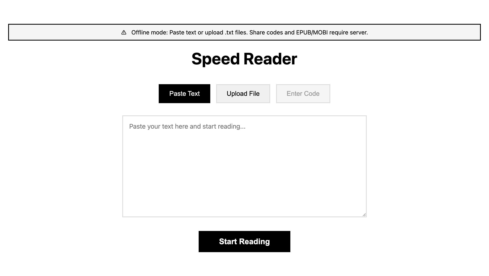
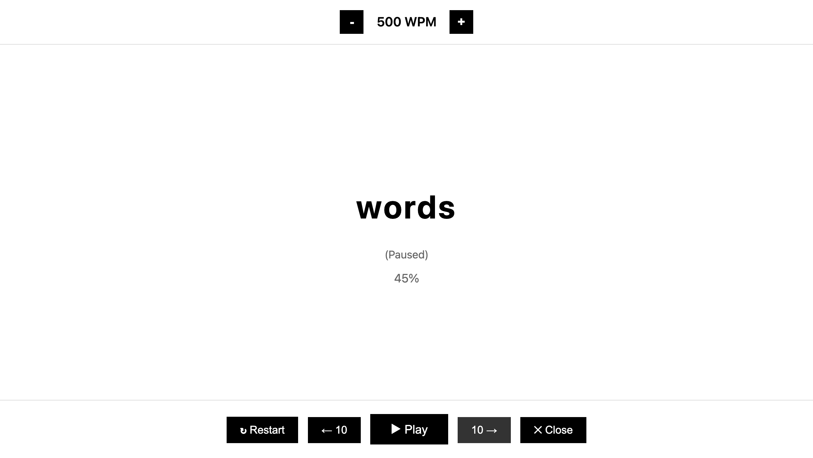

# Speed Reader

Minimalist web-based speed reading app using RSVP (Rapid Serial Visual Presentation). Read faster by displaying one word at a time.

**[Try it on GitHub Pages](https://asidko.github.io/500wpm/)** - works offline, no server needed for basic reading.





## Why?

Inspired by this post on X:


An average 250-page book will be read in about **2 hours and 5 minutes** at a reading speed of 500 words per minute.

## Features

- RSVP reading with 10-word warm-up (100→500 WPM)
- **Offline mode**: Paste text or upload .txt files without server
- Three input modes: paste text, upload files (.txt/.epub/.mobi), or enter share code
- **Share codes**: Upload once, read anywhere with a 6-digit code (requires server)
- Adjustable speed: 100-1000 WPM (±50 WPM steps)
- Navigation: skip ±10 words
- Keyboard shortcuts: `Space` (play/pause), `↑↓` (speed), `←→` (navigate)
- **Kindle & e-ink friendly** - optimized for e-readers with minimal refresh
- **Old browser support** - works on IE8+, Kindle browsers, legacy devices

## Quick Start

### Docker Compose (Recommended)

```bash
docker-compose up -d
```

Access at: **http://localhost:8000**

### Manual Setup

```bash
# Frontend
npm install && npm run build

# Backend
cd backend-go
go build -o server ./cmd/server
./server -static ../
```

## Configuration

| Flag | Env Var | Default | Description |
|------|---------|---------|-------------|
| `-port` | `PORT` | 8000 | Server port |
| `-db` | `DATABASE_PATH` | ./books.db | SQLite database path |
| `-static` | `STATIC_DIR` | ../ | Frontend files directory |
| `-rate-limit` | `RATE_LIMIT` | 120 | Requests/minute per IP |
| `-storage-days` | `STORAGE_DAYS` | 0 | Book TTL (0=forever) |

## API Endpoints

| Method | Path | Description |
|--------|------|-------------|
| `POST` | `/api/upload` | Upload file (epub/mobi/txt) |
| `POST` | `/api/text` | Submit pasted text |
| `GET` | `/api/book/{code}` | Retrieve book by code |
| `GET` | `/{code}` | Direct link to reader |
| `GET` | `/health` | Health check |

## Tech Stack

- **Frontend**: JavaScript (Babel ES5), Kindle-compatible CSS
- **Backend**: Go, Chi router, SQLite, sqlc
- **Features**: Per-IP rate limiting, SHA256 deduplication, graceful shutdown
